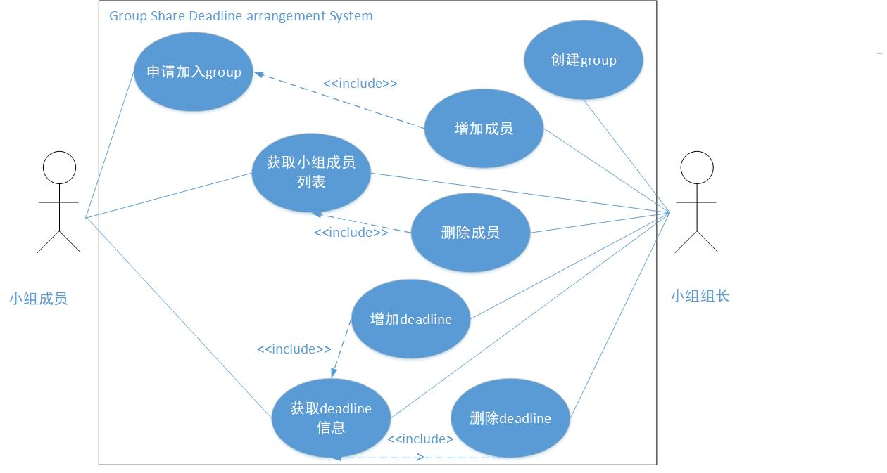

# ShareDDL - A Shared Deadline Manager (Backend)

### 简介

本仓库用于ShareDDL的后台服务器开发，以及部分产品开发计划及使用文档。

相关项目：

​	[ShareDDL总仓库](https://github.com/ktxlh/sw-gp4)

​	ShareDDL前端代码(undefined)	

### 用况图

**子系统1：**单人使用ShareDDL的主要用况

**子系统2：**团队DDL管理用况图

